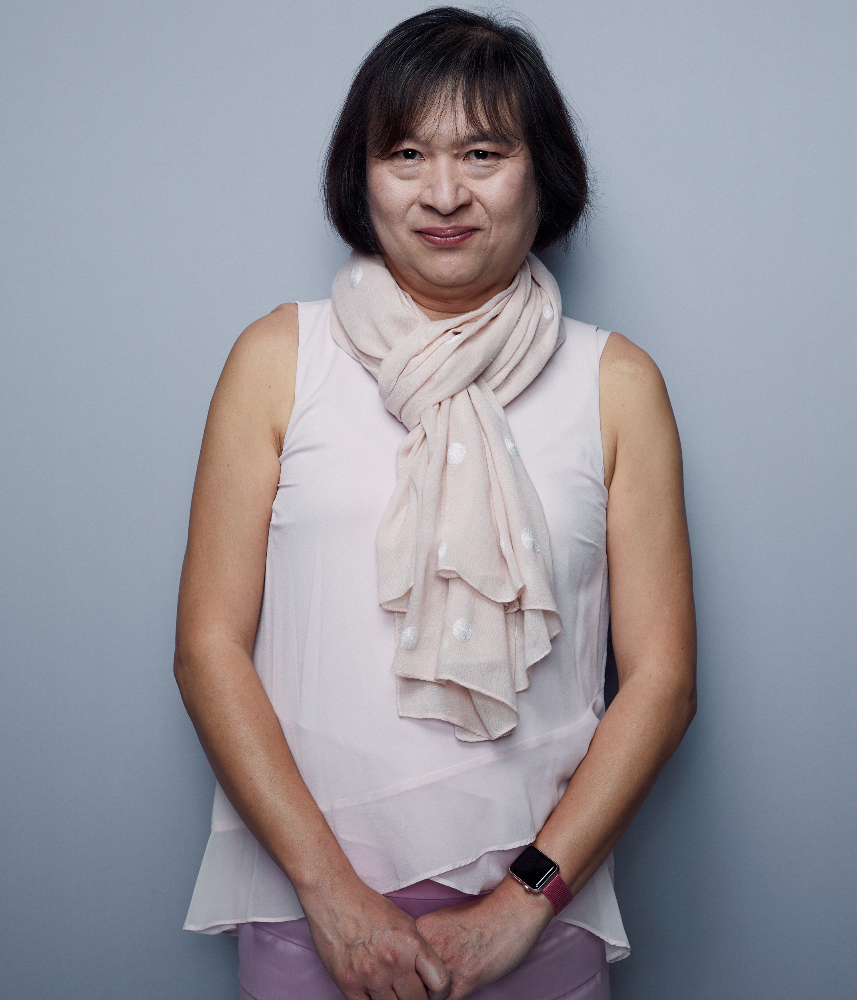

<style type="text/css">
.remark-slide-content {
    font-size: 30px;
    padding: 1em 4em 1em 4em;
}
</style>


# Lets get to know each other!

1. Grab a couple of copies of the handout
2. Introduce yourself to someone you haven't met before
3. Fill in BOTH SIDES of the handout to include...
-  your names
-  how you use R in your work (or pleasure)
-  your favourite R package
-  what you would like to learn next

THEN... Snap a selfie with your new R-Ladies friend and send it to .purple[rladiessydney@gmail.com]. We would love to use it on our event recap blog post. 

AND THEN... introduce yourself to someone new :)

---

class: split-two white

.column.bg-main1[.content.center[
<br>
# Lightning talk 1.

```{r echo=FALSE, out.width= "400px"}

```

# Sarah Romanes

]]
.column.bg-main2[.content.vmiddle.center[
# useR!2019 - my experience in Toulouse and all things R!

<br><br>

]]

---

class: split-two white

.column.bg-main1[.content.center[
<br>
# Lightning talk 2.

```{r echo=FALSE, out.width= "300px"}

```

# Chris Tham

]]
.column.bg-main2[.content.vmiddle.center[
# Multiplying in R
 
<br><br>

]]

---

class: split-two white

.column.bg-main1[.content.center[
<br>
# Lightning talk 3.

```{r echo=FALSE, out.width= "400px"}
knitr::include_graphics("pics/megan.jpg")
```

# Megan Capriccio

]]
.column.bg-main2[.content.vmiddle.center[
# How to impress your boss: ggplot + RMarkdown

 
<br><br>

]]


---

class: split-two white

.column.bg-main1[.content.center[
<br>
# Lightning talk 4.

```{r echo=FALSE, out.width= "300px"}

```

# Talia Hagerty


]]
.column.bg-main2[.content.vmiddle.center[
# R for World Peace

 
<br><br>

]]
---

class: split-two white

.column.bg-main1[.content.center[
<br>
# Lightning talk 5.

```{r echo=FALSE, out.width= "300px"}

```

# Rachel Mak

]]
.column.bg-main2[.content.vmiddle.center[
# cloudyR but shinyR: incorporating cloud computing into a Shiny app

 
<br><br>

]]

---

class: split-two white

.column.bg-main1[.content.center[
<br>
# Lightning talk 6.

```{r echo=FALSE, out.width= "300px", out.height= "300px"}

```

# Belinda Fabian

]]
.column.bg-main2[.content.vmiddle.center[
# Beginners teaching beginners: Learning R using meaningful data

 
<br><br>

]]


---

class: split-two white

.column.bg-main1[.content.center[
<br>
# Lightning talk 7.

```{r echo=FALSE, out.width= "300px"}

```

# Jen Richmond

]]
.column.bg-main2[.content.vmiddle.center[
# Memes, messages, mario, and more

 
<br><br>

]]


