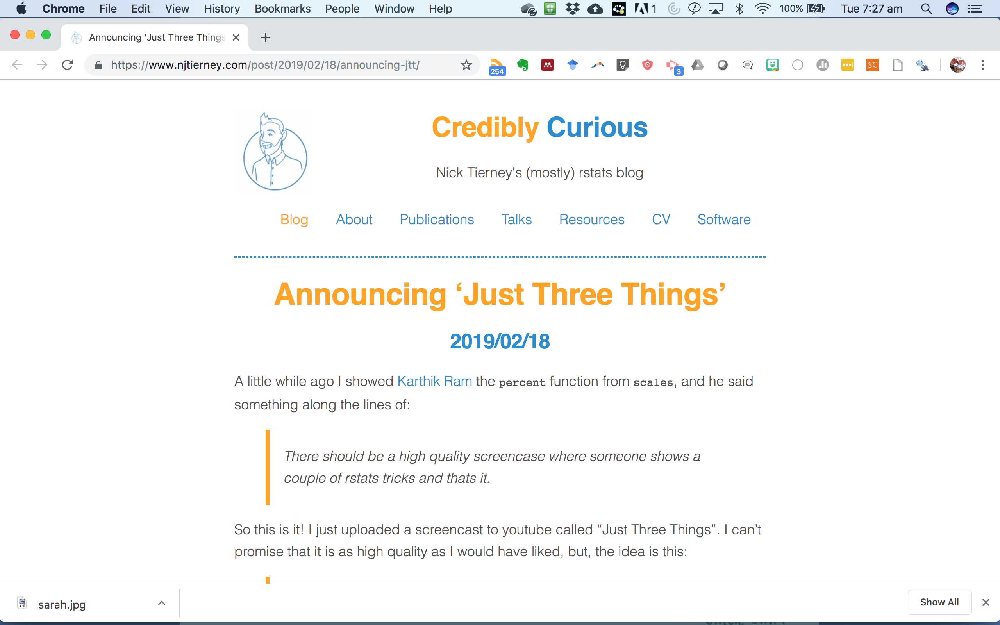
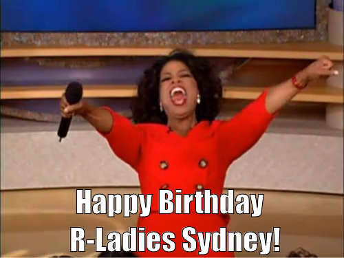
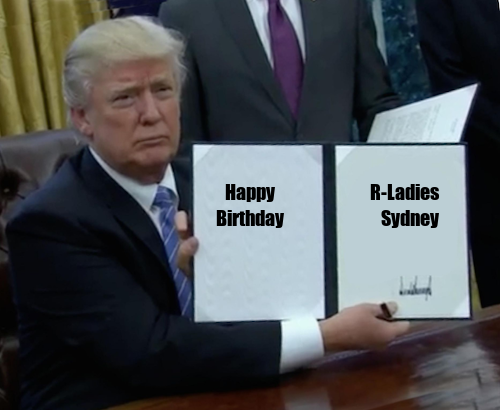
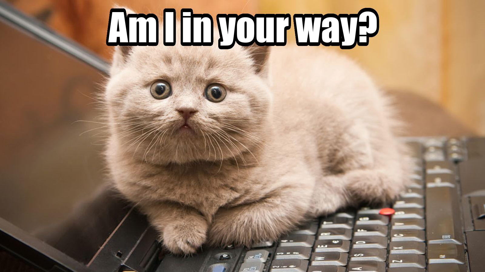
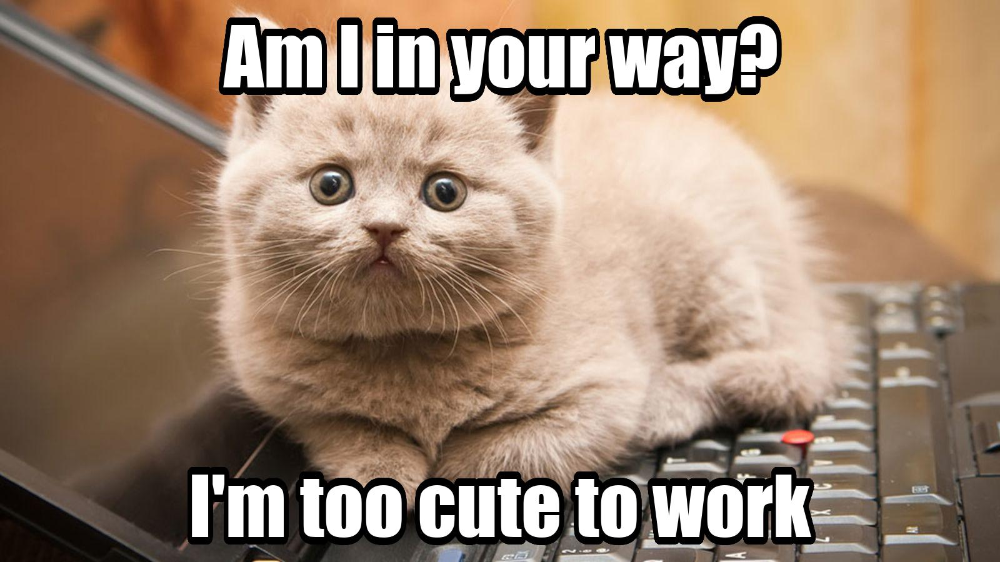
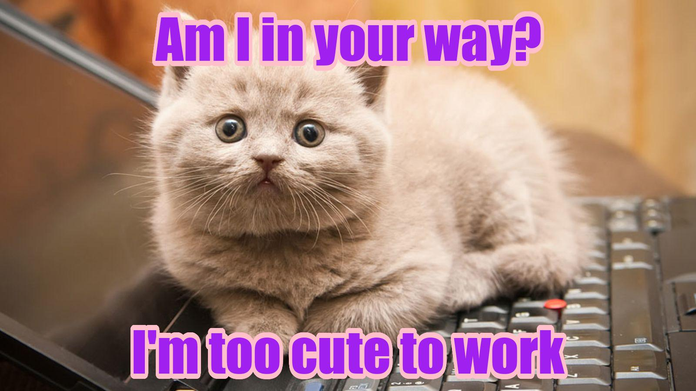

class: center, middle

<style type="text/css">
.remark-slide-content {
    font-size: 30px;
    padding: 1em 4em 1em 4em;
}
</style>

# You can find these slides at *https://tinyurl.com/birthdaymmm* 


---
class: split-two white

.column.bg-main1[.content.center[
<br>

# 3 Things

-  Memes (how to use R to put random words on random images to great effect)

- Messages (how to have RStudio make you laugh and give you praise)

- Mario (how to have mario tell you when you script is done)

]]
.column.bg-main2[.content.vmiddle.center[

```{r echo=FALSE, out.width= "400px"}

```
 
<br><br>


]]

---
# 1. Memes

```{r echo=FALSE, out.width= "600px"}
knitr::include_graphics("img/models.jpg")
```
<br>
<br>
rstats memes are big on twitter, 
follow @rstatsmemes to keep up with them

---
```{r echo=FALSE, out.width= "600px"}

```

If you want to replace the text on popular memes with your own...
---

```{r echo=FALSE, out.width= "600px"}

```

...you can probably get away with the .purple[memer] package
---

```{r echo=FALSE, out.width= "700px"}

```

But there are other packages that let you make memes from any image. I wrote a [blog post](http://jenrichmond.rbind.io/post/making-memes-in-r/) about making memes. Check it out for more info.  

---
# My favourite is the .purple[memery] package. 

### install the package
```{r eval=FALSE}
install.packages("memery")
```

### load the package

```{r message=FALSE, warning=FALSE}
library(memery)
```

---
class: split-two white

.column.bg-main1[.content.center[
<br>

### define your txt 
```{r}
txt <- c("Am I in your way?")
```

### use the `memery::meme()` function to overlay the txt on the kitten image and save to jpg. (size controls the size of the text).

```{r}
memery::meme("kitten.jpg", txt, 
             "meme.jpg", size = 3)
```

]]
.column.bg-main2[.content.vmiddle.center[

```{r echo=FALSE, out.width= "500px"}
knitr::include_graphics("meme.jpg")
```
 
<br><br>

]]

---
class: split-two white

.column.bg-main1[.content.center[
<br>

### you can add txt top and bottom 
```{r}
txt2 <- c("Am I in your way?", 
         "I'm too cute to work")
```


```{r}
memery::meme("kitten.jpg", txt2, 
             "meme2.jpg", size = 3)
```

]]
.column.bg-main2[.content.vmiddle.center[

```{r echo=FALSE, out.width= "500px"}

```
 
<br><br>

]]

---


### you can change the text color
```{r}
txt2 <- c("Am I in your way?", 
         "I'm too cute to work")

clrs <- c("purple", "pink")
```

### make text purple and shadow pink. 
```{r}
memery::meme("kitten.jpg", txt2, 
             "meme3.jpg", size = 3, 
             col = clrs[1], shadow = clrs[2])
```
---

```{r echo=FALSE, out.width= "700px"}

```

---

# 2. Messages
```{r echo=FALSE, out.width= "700px"}
knitr::include_graphics("img/message.png")
```

---

# Customise your .rprofile

You will need to install the following packages:

- .purple[usethis]
- .purple[goodshirt]
- .purple[cowsay]
- .purple[praise]

### Use .purple[usethis] to open your .rprofile file

```{r eval = FALSE}
usethis::edit_r_profile()
```

---

### Customise your .rprofile file, save and close the file, then restart R
I put a copy of my .rprofie on [git here](https://github.com/jenrichmond/RLadiesSydneyBirthday/tree/master/memes_messages_mario)
```{r eval = FALSE}
#start with a quote from The Good Place (requires goodshirt package) 
#spoken by a random ASCII animal (requires cowsay package)

if (interactive() && require("goodshirt", 
  quietly = TRUE)) {
  goodshirt::soul_squad()
  cowsay::say(as.character(soul_squad()),
              by = "random",
              what_color = crayon::blue$bold,
              by_color = crayon::blue$bold)
  
# then get some random praise to get you started 
  #for the day (requires the praise package) 
  
  message("\nHappy Coding Jen!", "💜")
  message(praise::praise())

}
```
### 


---
# 3. Mario

### Do you write code that takes a long time to run?

You need the .purple[beepr] package. 

```{r eval=FALSE}
install.packages("beepr")
```

```{r}
library(beepr)
```

```{r}
beepr::beep()
```

---
1. "ping"
2. "coin"
3. "fanfare"
4. "complete"
5. "treasure"
6. "ready"
7. "shotgun"
8. "mario"
9. "wilhelm"
10. "facebook"

```{r}
beepr::beep("mario")
#or
beepr::beep(8)
```

[Link](https://youtu.be/Rc1t-MeVcjo) to youtube


---
#Thanks! 


```{r echo=FALSE, out.width= "500px"}
knitr::include_graphics("https://media.giphy.com/media/qfBrXyuWoNXIQ/giphy.gif")
```

